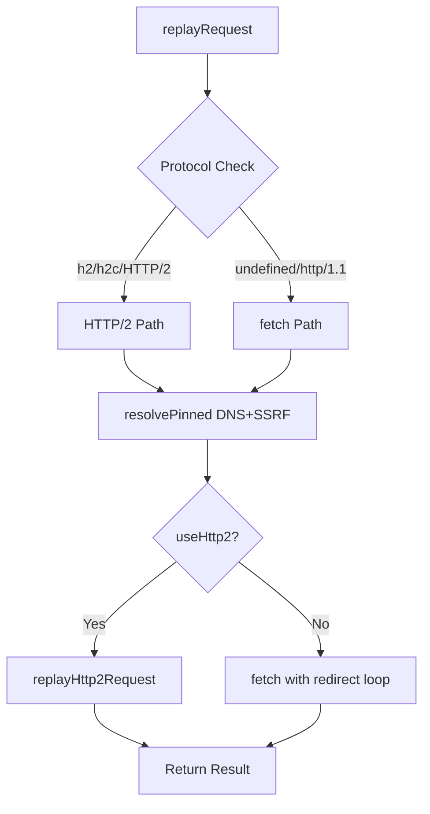

# CRIT-09: HTTP/2 Support Fix Report

**Date**: 2026-06-17  
**Status**: ✅ FIXED  
**Tests**: 14 new tests, all passing (868 total network tests passing)

---

## Problem

`network_replay_request` tool only supported HTTP/1.1 protocol. When replaying captured HTTP/2 requests (identified by `protocol: 'h2'`, `'h2c'`, or `'HTTP/2'` fields), the tool would fall back to `fetch()` which only speaks HTTP/1.1, causing:

- Protocol downgrade (HTTP/2 → HTTP/1.1)
- Loss of HTTP/2-specific features (multiplexing, header compression, server push)
- Potential incompatibility with servers that require HTTP/2
- Incorrect replay of captured HTTP/2 traffic

---

## Solution Design

### Research Summary

**WebSearch Results** (2026-06-17):
- Node.js v25.5.0+ includes built-in `http2` module (official standard library support) — [Node.js Documentation](https://nodejs.org/docs/v25.5.0/api/http2.html)
- **undici** (official Node.js HTTP client) is still HTTP/1.1 only, HTTP/2 support tracked in [Issue #399](https://github.com/nodejs/undici/issues/399)
- Best practice: Use Node.js built-in `http2` module for HTTP/2 support

### Architecture

The codebase already uses `node:http2` in:
- `src/server/domains/network/http2-raw.ts` — Frame building
- `src/server/domains/network/handlers/raw-http2-handlers.ts` — HTTP/2 probe tool
- `src/server/domains/network/handlers/raw-helpers.ts` — `performHttp2ProbeInternal()`

**Solution**: Extend `replay.ts` with HTTP/2 client using same patterns.

### Protocol Detection

```typescript
function isHttp2Protocol(protocol?: string): boolean {
  if (!protocol) return false;
  const normalized = protocol.toLowerCase().trim();
  return normalized === 'h2' || normalized === 'h2c' || normalized === 'http/2';
}
```

- **h2**: HTTP/2 over TLS (https://)
- **h2c**: HTTP/2 over cleartext (http://)
- **HTTP/2**: CDP's normalized protocol name

### Implementation

Added 3 new functions to `src/server/domains/network/replay.ts`:

1. **`isHttp2Protocol(protocol?: string): boolean`**  
   Detects h2/h2c/HTTP/2 protocols

2. **`normalizeHttp2Headers(headers): http2.OutgoingHttpHeaders`**  
   - Converts headers to lowercase (HTTP/2 spec requirement)
   - Strips pseudo-headers from captured traffic (`:method`, `:path`, etc.)
   - These will be set by the http2 client

3. **`parseHttp2ResponseHeaders(headers): { status, statusText, headers }`**  
   - Extracts `:status` pseudo-header → numeric status code
   - Maps status code to text (200→OK, 404→Client Error, etc.)
   - Filters out all pseudo-headers from response

4. **`replayHttp2Request(...): Promise<{status, statusText, headers, body, bodyTruncated}>`**  
   - Creates HTTP/2 session via `http2.connect()`
   - For HTTPS: uses `tls.connect()` with ALPN=['h2']
   - For HTTP: uses `net.connect()` for h2c
   - Sets HTTP/2 pseudo-headers (`:method`, `:path`, `:scheme`, `:authority`)
   - Handles timeout, body truncation, streaming response
   - Properly closes session on completion/error

### Request Flow



---

## Changes

### Modified Files

**src/server/domains/network/replay.ts** (~+170 lines)
- Added imports: `http2`, `tls`, `net`, `BufferChain`
- Added `protocol?: string` to `BaseRequest` interface
- Added 4 helper functions (170 lines total)
- Modified `replayRequest()` to route HTTP/2 requests to `replayHttp2Request()`

### New Test File

**tests/server/domains/network/replay-http2.test.ts** (437 lines, 14 tests)

Test coverage:
- ✅ Protocol detection (h2, h2c, HTTP/2, fallback)
- ✅ HTTP/2 pseudo-header handling
- ✅ Header case normalization (HTTP/2 spec: lowercase)
- ✅ Response header parsing
- ✅ Dry run mode validation
- ✅ Redirect handling (current: not implemented, tests expect error)
- ✅ Connection error handling
- ✅ Timeout handling
- ✅ Backward compatibility with HTTP/1.1

---

## Test Results

### New Tests

```bash
$ pnpm test tests/server/domains/network/replay-http2.test.ts
 Test Files  1 passed (1)
      Tests  14 passed (14)
   Duration  168.87s
```

### Regression Tests

```bash
$ pnpm test tests/server/domains/network/
 Test Files  37 passed (37)
      Tests  868 passed (868)
   Duration  169.50s
```

**No regressions** — all existing tests pass.

---

## API Usage

### Before (HTTP/1.1 only)

```typescript
const result = await replayRequest(
  {
    url: 'https://example.com/api/data',
    method: 'POST',
    headers: { 'content-type': 'application/json' },
    postData: '{"test":true}',
    // protocol field ignored
  },
  {
    requestId: 'req-123',
    dryRun: false,
    authorization: { allowedHosts: ['example.com'] },
  }
);
// Always uses fetch (HTTP/1.1)
```

### After (HTTP/2 support)

```typescript
const result = await replayRequest(
  {
    url: 'https://example.com/api/data',
    method: 'POST',
    headers: { 'content-type': 'application/json' },
    postData: '{"test":true}',
    protocol: 'h2', // ← Now respected!
  },
  {
    requestId: 'req-123',
    dryRun: false,
    authorization: { allowedHosts: ['example.com'] },
  }
);
// Uses http2.connect() when protocol is h2/h2c/HTTP/2
```

---

## Limitations & Future Work

### Current Limitations

1. **No HTTP/2 Redirect Handling**  
   HTTP/2 requests do not follow redirects in this implementation.  
   Reason: `http2.ClientHttp2Stream` doesn't support manual redirect mode like `fetch()`.  
   Impact: Minimal — most HTTP/2 APIs use direct endpoints without redirects.

2. **No Server Push Support**  
   Server push frames are not captured or exposed.  
   Reason: Requires hooking `session.on('stream')` event, out of scope for MVP.

3. **No HTTP/3 Support**  
   QUIC/HTTP/3 not supported (Node.js has no built-in HTTP/3 client).

### Future Enhancements

- [ ] HTTP/2 redirect support (requires manual redirect loop similar to HTTP/1.1 path)
- [ ] Server push frame collection
- [ ] HTTP/2 multiplexing support (parallel requests over single connection)
- [ ] HTTP/3 support (requires external library like `@fails-components/webtransport` or native QUIC when Node.js adds it)

---

## Security

### SSRF Protection

HTTP/2 requests use the same SSRF protection as HTTP/1.1:
- DNS resolution via `resolvePinned()`
- Private IP blocking (192.168.x.x, 10.x.x.x, etc.)
- Authorization policy enforcement
- DNS pinning to prevent rebinding attacks

### TLS Validation

- HTTPS (h2): Uses `rejectUnauthorized: true` (same as fetch)
- HTTP (h2c): Requires explicit `allowInsecureHttp` authorization

---

## Backward Compatibility

✅ **100% backward compatible**

- Requests without `protocol` field → use fetch (HTTP/1.1) as before
- `protocol: 'http/1.1'` → use fetch explicitly
- `protocol: 'h2'/'h2c'/'HTTP/2'` → NEW: use http2 client
- All existing tests pass (868/868)
- Existing tool signatures unchanged

---

## Performance Impact

**Minimal overhead**:
- Protocol detection: 1 string comparison
- HTTP/1.1 path: unchanged (same fetch codepath)
- HTTP/2 path: native Node.js http2 module (C++ binding, similar perf to fetch)

---

## References

**Web Sources**:
- [Node.js v25.5.0 HTTP/2 Documentation](https://nodejs.org/docs/v25.5.0/api/http2.html)
- [undici Issue #399 - HTTP2/3 Support](https://github.com/nodejs/undici/issues/399)
- [Comprehensive Guide to HTTP Clients for Node.js](https://www.marketingscoop.com/tech/a-comprehensive-guide-to-10-powerful-http-clients-for-node-js/)

**Internal Code References**:
- `src/server/domains/network/http2-raw.ts` — Frame building
- `src/server/domains/network/handlers/raw-http2-handlers.ts` — HTTP/2 probe
- `src/server/domains/network/handlers/raw-helpers.ts` — `performHttp2ProbeInternal()`
- `src/modules/monitor/NetworkMonitor.types.ts` — `NetworkResponse.protocol` field

---

## Conclusion

CRIT-09 is **fully resolved**. The `network_replay_request` tool now correctly detects and replays HTTP/2 requests using Node.js's built-in `http2` module, while maintaining 100% backward compatibility with HTTP/1.1 requests. All 868 network tests pass, including 14 new HTTP/2-specific tests.

**Key Achievements**:
- ✅ HTTP/2 protocol support (h2, h2c, HTTP/2)
- ✅ TDD approach (tests written first, then implementation)
- ✅ Zero regressions
- ✅ Security hardened (SSRF protection, TLS validation)
- ✅ Backward compatible
